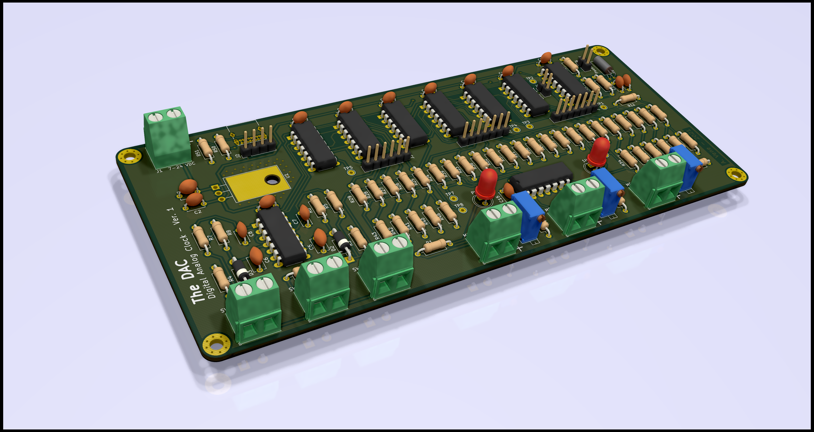
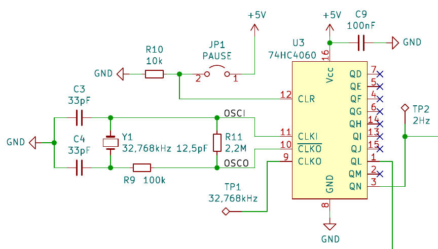

# The DAC -The Digital Analog Clock

The primary goal of this project was to design and build a clock, without a single line of code running on the clock hardware. To do this, the time keeping circuit (the digital part) was implemented by hard-wiring together classic 74-series logic chips. The time display was implemented using three analog meters driven by three adjustable current sources (the analog part) controlled by the timekeeping circuit.

As an additional constraint, the circuit was built using only trough hole components (a welcome change of pace, since lately I mostly make circuits with surface mount components)

# Theory of operation

In general the circuit can be presented as follows (for full circuit schematic, refer to [circuit documentation](Documentation/TheDAC.pdf)):

## Crystal oscillator and clock divider

Every clock needs a stable frequency source. In this case, it is based around a common 32,768kHz watch crystal (Y1) and the oscillator section of the 74HC4060 integrated circuit (U3). The chosen oscillator frequency is a power of two (`2^15 = 32768`) which can conveniently be divided down to 1Hz using binary counters.

The oscillator output of 74HC4060 is then internally connected to the first stage clock input of its 14-stage binary ripple counter section. Each counter stage is basically a T-type flip-flop that inverts (toggles) its output state when a falling edge is detected on its clock input. Effectively each stage divides its clock signal frequency by 2. Counter stages are wired in series, where each stage feeds the clock input of the next stage.

Given a 14 stage counter, its input clock frequency will be divided by `2^14 = 16384` on the output of its last (14th) stage. With the oscillator frequency 32,768kHz, the last counter stage will output a 2Hz signal which then gets sent to the seconds counter circuit. In this circuit, the 12th stage output (8Hz signal) is also used by the time setting user interface circuit. 

## Seconds, minutes and hours counters

Hours, minutes and seconds counters are each constructed around a 74HC4024 7-stage binary ripple counter

Looking at the seconds counter (U6), its clock input is driven by a 2Hz signal from the oscillator circuit, which gets divided to 1Hz by the counters first stage and output (Q0) to a test point and a LED (D4). Conveniently this 1Hz signal is also internally wired to the remaining 6 subsequent counter stages with their outputs (Q1 to Q6) representing the seconds count in parallel binary format.

When the seconds counter gets to 60 (or `111100` in binary), the counter should immediately (asynchronously) resets back to 0. This condition is detected by feeding the 4 most significant outputs (Q3 to Q6) in to one of 74HC21 4-input AND gates (U7B) which when all four inputs are high generates a high signal, which can then be used as a reset signal for the second counter and a clock pulse for the minutes counter.

The seconds counter reset signal gets combined with the user interface stop signal by a logic OR function implemented using two NOR gates (U5D and U5C). The clock pulse for the minutes counter is combined with the user interface increment seconds signal and inverted by a NOR gate (U5A).

Moving on to the minutes counter (U8), the circuit functions very similarly to the seconds counter circuit, with differences being that the first counter stage isn't needed for clock division and is directly used as the minutes count least significant bit (LSB) and the minutes counter reset signal is connected directly to the output of the 4-input AND gate (U7A). The last counter stage is simply ignored.

The hours counter follows much the same operating principles with the difference being, that it needs to reset when reaching 24 (`11000` in binary). This function is done by wiring the two most significant hour count bits (outputs Q3 and Q4) through a logical AND block (implemented using two NAND gates U4D and U4C) to the counter reset input. The last two counter stages are ignored.

Some basic logic functions such as hours reset logic AND circuit and seconds reset combining OR circuit have been implemented using multiple logic gates. This was done to avoid having to add additional logic chips with exact needed function and then have several unused logic gates in various chips (most classic 74-series basic logic gate chips usually have multiple logic gates per package)

## Digital to analog conversion and current driver circuit

As mentioned previously, seconds (6 bits), minutes (6 bits) and hours (5 bits) counters output their count values in parallel binary format. These outputs are used to drive 3 digital to analog converters (DAC) that are implemented as simple R-2R resistor ladders.

The analog voltage signals from R-2R DACs are then connected to the current driver inputs. A single current driver is implemented using one of four operational amplifier blocks of the LMC6486 Quad Op-Amp IC (U10). Each Op-Amp block amplifies the voltage difference between its two inputs: `V_out = G * (V(+) - V(-))`, where `G` is amplifier gain (usually a very large number). So if the `V(+)` input goes higher than `V(-)` the Op-Amp output `V_out` will also pull higher and vice versa.

The R-2R DAC output signal is fed in to the Op-Amp `V(+)` input, while its output is wired through an analog micro ampere meter in to its `V(-)` and then through a variable resistor to ground, forming a negative feedback loop. In this configuration the Op-Amp will drive its output so that the `V(-)` input voltage (voltage drop across the adjustable resistor) is effectively equal to `V(+)` input voltage.

With counters at their maximum values (59 for seconds and minutes counters and 23 for hours counter) the variable resistors are set so that the current needed to cause voltage drops across the adjustable resistor equal to ADC output voltage is equal full scale current of analog ampere meters. In this case very sensitive (50uA full range) analog ampere meters have been chosen, so that Op-Amp outputs are powerful enough to drive the needed full scale current without the need for any external amplification stages.  

The unused Op-Amp block has its inputs wired to its power supply rails, so that the output is forced in to a defined state. If the inputs were left floating, tit would be possible for the output to wander around unpredictably, possibly causing interference. In this application this probably wouldn't be an issue, but in a more sensitive circuit this could be critical.

## Time setting user interface

Time setting interface consists of three user inputs: a toggle switch that enables time setting mode and two push buttons used to manually increment minutes and hours counts. Closing the "run/stop" toggle switch (SW1) forces the seconds counter reset input high (stop signal), effectively stopping the counter and holding it at 0, wile also enabling minutes and hours setting push buttons (SW2 and SW3 respectively).

Push button contacts closing together isn't a perfect one time event due to contacts bouncing against each other before settling and completely closing together. The counter chips used in this circuit are more than fast enough to count individual contact bounce events which means one button press can be counted as wildly varying number of button presses. To filter contact bounce out from the push button signal a combination of a low-pass filter and schmitt trigger is used.

Looking at the minute setting circuit, SW2 push button signal (yellow trace) feeds in to the low pass filter consisting of resistor R5 and capacitor C7 (blue trace) which then feeds in to one of two inputs of a 74HC132 schmtt trigger input NAND gate U2D. This filters or "debounces" the raw push button signal. In its idle state the U2D gate is high and for it to go in to its active low state, both inputs need to be high. The second input of U2D is fed by another NAND gate U2C which also idles high.

Gate U2C acts as a valve for the 8Hz signal on one of its inputs, which gets used to automatically increment after a delay period if the button SW2 is kept closed. The time delay circuit consists of resistor R6, capacitor C5 and diode D2. When SW2 is closed, C2 slowly charges trough R6 which after some time charges to a level that triggers the schmitt trigger input, which opens the path for the 8Hz signal to start toggling the U2D gate output. When SW2 is released, capacitor C7 quickly discharges trough diode D2 and resistor R3, resetting the time delay for the next button press.

Finally, because an active high signal is needed to increment the counter, the output of U2D is inverted (purple trace) using another NAND gate U4B that is wired to act as a NOT gate.

The hour setting circuit is identical to the minute setting circuit